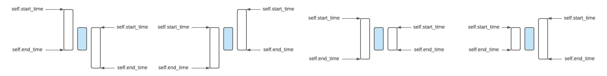
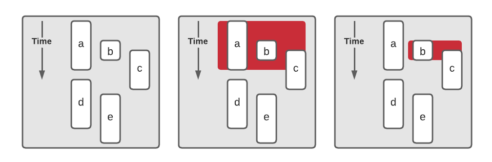
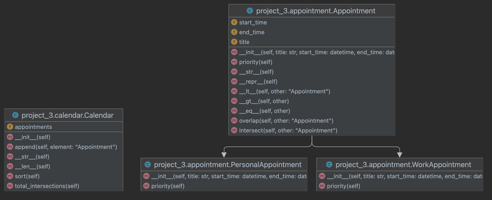

# Project-3-Calendar

Test driven development task to demonstrate abstract class, overriding, and wrapping.

The goal of this project is to create a calendar where it can have a
collection of appointments module. Also, it tries to check for overlapping
appointments. 

## Assignment:

- Similar to the last assignment the workflow is as usual:
    1. Before you edit any file, carefully read the comments inside each file.
    2. Test your program locally; revise and re-test as needed. 
    3. Commit and push your changes to your own repository.
    4. The `credentials.ini` file is not provided, but you have to create one yourself and submit it to
       [Blackboard](https://lms.qu.edu.sa/) as we have seen in project-0.
- This time all the files are given to you. The project has a total of six files.
    - The `appointment.py` is the module for the appointments classes. We use `test_appointment.py` to test this module. 
    - The `calendar.py` is the module for the calendar class. We use `test_calendar.py` to test this module.
    - The files `utility.py` and `generator.py` are modules that have helper methods. You might find something valuable in `utility.py`.
- You should start by implementing the appointment module requirements.
  In the appointment module you are given skeleton classes to get started.
  We implemented the constructors for all of them, but you might need to change the constructor of `WorkAppointment` and
  `PersonalAppointment`.
  All you need is to validate the `start_time` and `end_time` before you create an object. 
- In the `Appointment` abstract class we implemented the `priority` and `__str__` methods for you.
  However, you should override the `priority` method for both `WorkAppointment` and `PersonalAppointment` where it
  returns 1 for `WorkAppointment` and 2 for `PersonalAppointment`.
  See the test case `test_priority` for more information.
- By fixing the constructors of `WorkAppointment` and `PersonalAppointment` and implementing the `priority` method for
  each, these two classes should be ready.
  All the remaining work should be in their parent class.
- Next, implement the `__lt__` and `__gt__` methods for the `Appointment` class.
  These are very critical methods, and you should carefully implement them.
    - `<`: "before". Appointment `a` is before appointment `b` iff the finish time of `a` is equal or earlier than the start time of `b`.
    - `>`: "after". Appointment `a` is after appointment `b` iff the start time of `a` is equal or after the finish time of `b`.
- The next method you should implement is the `__eq__` method.
  We say two appointments are equal if they have the same `start_time` and `end_time`.
  The title of the appointment does not matter in equality. 
- By now you should have implemented all the basic methods.
  You have two other methods left in `Appointment`.
  First, the `overlap` method where you return True if two appointments overlap.
  Second, the `intersect` method where you find the duration of overlap in **hours** (see `utility.py` for help). 
- We say two appointments overlap if they share the same time.
  For example, if we have scheduled office hours from 12:00pm to 1:30pm, and scheduled another meeting from 1pm to 2pm,
  then there is a conflict in our schedule because those appointments overlap in time.
  Note that you have already implemented methods to determine whether an appointment `a` is over when appointment `b`
  starts (i.e., `(a < b)` or vice versa `(a > b)`).
  You should make use of these rather than coding the same logic again.
- You must also create method `intersect` for determining the period (in hours) of overlap between two appointments.
  We gave you a helper method in `utility.py` that convert duration to hours.
  You may use it if you want. In the example from the point above, the intersect method should return 0.5.
- The main difference between `overlap` and `intersect` is that the overlap tells you if there is overlap while
  intersect gives you the duration of overlap.
  You might find the figures below helpful in understand what overlap means. 

- By now if you implemented all the methods for Appointment above correctly, all the test cases in `test_appointment.py`
  should pass.
- Next, we need to implement what is left of the Calendar class.
  All the methods for the Calendar class are written for you.
  However, the ones that have `raise NotImplemented("FIX ME!")` mean you should fix the method.
  As you may have already noticed, the Calendar class is a wrapper class.
  It wraps the list class.
  Thus, we need to implement some list methods ourselves. 
- First unimplemented method is the `__len__` methods.
  By implementing `__len__` we would be able to say `len(an instances of Calendar)` where we would get the number of
  elements in the list `self.appointments`.
  I.e., we delegate the `len` method from `list`.
- The other methods that you need to implement is the `total_intersections` method.
  The main goal of this method is to return the total overlap duration in the whole calendar.
  Thus, you need to loop through the list of appointments to check for overlap as you implemented it in the class
  `Appointment`.
  We already defined what it means for two appointments to overlap.
  However, in the calendar you should consider that there might be more than two elements overlapping.
  Suppose we have appointments a...e with start and finish times as shown on the figure below.
  These appear in the Calendar object in order a, b, c, d, e, that is, in order of their start times (because we can
  sort them in that order using the `sort` method).
  Now consider which appointments `a` must be compared with.
  We must compare `a` with `b` and then with each subsequent appointment until we reach `d`.
  When we reach `d` and notice that `d` starts after `a` is finished, we do not have to look farther.
  Any appointment object that appears after `d` in the sorted sequence must also start after `a` has finished; thus,
  it has no overlap with `a`.
  Next consider the set of appointments we must compare `b` with. We do not need to consider `a` again, because we have
  already found that conflict.
  We must consider the appointments that appear after `b` in the sorted list, but only until we find one that starts
  after `b` has finished.
  Given this explanation try implementing your search algorithm using two nested loops (for loop inside another one).
  But it is important that you break the search of the inner loop to achieve a fast search.

- We have created three different test cases for the `total_intersections`.
  The first one test the correctness of the search and calculations, while the other two test the performance of the
  method.
  We add 10,000 appointment on each to see if you can search them in less than 2 seconds.
  This is possible if you know when to stop searching for overlap in a given appointment. 
- When you have completed these steps, all the test cases should succeed.
  Note that this is not an ironclad guarantee that your code is correct.
  We will use a few more tests, which we do not share with you, in grading.
  Our extra tests help ensure that you are really solving the problem and not taking shortcuts that provide correct
  results only for the known tests.
- In addition to passing all test cases, you should also adhere to our coding style principles. You should always refer
  to the coding style cheat sheet. However, one of the most essential representations we agreed on is to give the hints types.
  For example, when we say a `self` method `foo` should take two integers `x` and `y`, and return a string. The expected method signature should look like this `def foo(self, x: int, y: int) -> str:`.
  As always, when in doubt, check the [PEP8](https://peps.python.org/pep-0008/) instructions.
  To double-check your work use the following two commands.
    - `pylint --attr-naming-style any --argument-naming-style any --disable=C0123 <file_name.py>`
    - `flake8 --select="ANN001,ANN201,ANN202,ANN203,ANN204,ANN205,ANN206" --suppress-none-returning <file_name.py>`

## Class Diagram

## Reminders

- The `credentials.ini` file MUST include your full information. And must be named correctly.

- DO NOT push any changes to your repo after the deadline. When we clone
  your repo given the key, we will check when was the last update on your
  repository. If you made any changes passed the deadline you will immediately 
  get 20% deducted.

## Grading Rubric

- **[80 Points]** For passing all OUR tests except the two performance tests.
  As stated in the assignment instructions, we will have our own additional test cases that test the same core functionalities but make sure you're not taking any shortcuts. 
  Passing all of them guarantees you will get full points.
- **[20 Points]** For following the given coding style as given in the cheat sheet and PEP8.
- **[10 Points]** Bounce if you pass the last two performance test cases (actually the one similar to them that we have).

# All Rights Reserved

This is the work of Ziyad Alsaeed. Any copy or distribution of this
repository or a fork of it in a way other than the instruction provided
above will subject you to legal proceedings.
